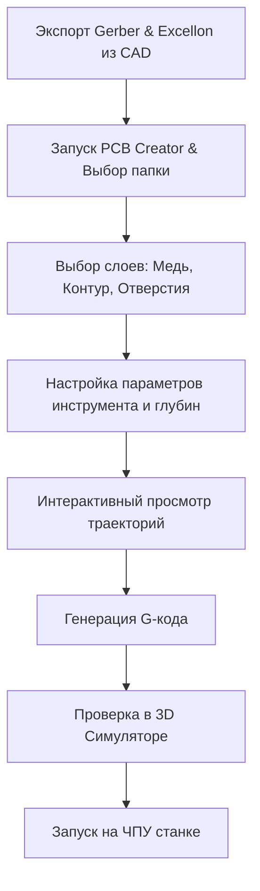

# PCB_GCODE_toolbox

Инструментарий для подготовки управляющих программ (G-кода) для фрезерно-гравировальных станков с ЧПУ на основе файлов проектирования печатных плат (Gerber и Excellon).

Проект состоит из двух ключевых компонентов:
1. **PCB Creator** — генератор траекторий изоляции, очистки меди (Rubout), обрезки контура платы и сверловки отверстий с интерактивным 2D-превью.
2. **PCB Simulator** — 3D-симулятор обработки, позволяющий визуализировать траекторию движения инструмента и глубину резания перед запуском на реальном станке.

---

## 🚀 Быстрый запуск

### Windows (Автоматический запуск)
Для пользователей Windows подготовлен скрипт автозапуска, который сам создаст виртуальное окружение, установит зависимости и запустит приложение:
1. Клонируйте репозиторий или скачайте его как ZIP-архив.
2. Запустите файл `start.bat`.
3. Приложение автоматически откроется в браузере по адресу: [http://127.0.0.1:8000](http://127.0.0.1:8000).

### macOS / Linux (Ручной запуск)
1. Убедитесь, что у вас установлен Python версии 3.10 или выше.
2. Откройте терминал в папке проекта и создайте виртуальное окружение:
   ```bash
   python3 -m venv .venv
   source .venv/bin/activate
   ```
3. Установите зависимости:
   ```bash
   pip install -r requirements.txt
   ```
4. Запустите сервер:
   ```bash
   python main.py
   ```
5. Перейдите в браузере по адресу: [http://127.0.0.1:8000](http://127.0.0.1:8000).

---

## 🛠️ Пайплайн производства печатной платы

Весь процесс подготовки файлов к фрезеровке делится на следующие шаги:



### Шаг 1: Подготовка файлов в вашей CAD-системе
Экспортируйте из вашей программы проектирования (EasyEDA, KiCad, Altium и др.) файлы в формате **Gerber (RS-274X)** и **Excellon (Drill)**:
- Медный слой: верхний слой (`.GTL`) и/или нижний слой (`.GBL`).
- Контур платы: слой границ (`.GKO` или `.GM1`).
- Отверстия: файл сверловки (`.DRL` или `.TXT`).

### Шаг 2: Настройка проекта в PCB Creator
1. Нажмите кнопку **"Выберите папку с Gerber файлами"** в интерфейсе программы.
2. Программа автоматически просканирует папку и распределит файлы по категориям. При необходимости скорректируйте выбор вручную.
3. Выберите обрабатываемую сторону платы (**Top** или **Bottom**).

### Шаг 3: Настройка параметров траектории
Для каждой операции задаются индивидуальные параметры фрезы:
- **Ширина изоляции (Isolation):** Диаметр гравера (например, 0.2 мм), глубина резания (обычно 0.1 мм) и рабочие подачи. Режим *Rest Clearing* позволяет автоматически досверливать узкие места более тонким инструментом.
- **Очистка меди (Rubout):** Удаление неиспользуемой меди с больших областей платы для предотвращения случайных замыканий.
- **Контур платы (Outline):** Задается диаметр концевой фрезы (например, 1.0 или 2.0 мм) и глубина прорезания платы (например, 1.6 мм). Можно настроить прорезку за несколько проходов (*Depth per pass*).
- **Сверление (Drills):** Параметры для автоматического создания карт отверстий.

### Шаг 4: Двусторонняя обработка и референсные пины
Для изготовления двусторонних плат активируйте опцию **Use Alignment Pins (Использовать направляющие штифты)**:
1. Программа сгенерирует файл `alignment_pins.gcode` для сверления калибровочных отверстий в подложке стола.
2. При переходе к нижней стороне (**Bottom**) геометрия платы автоматически отзеркаливается по горизонтали относительно её геометрического центра.
3. Вы просто переворачиваете плату на штифтах, и ЧПУ-координаты идеально совпадают с обратной стороной.

### Шаг 5: Симуляция и фрезеровка
1. Нажмите кнопку **"Генерировать G-код"**. В папке проекта создастся директория `gcode_output_{side}` с файлами `.gcode` для каждой операции.
2. Загрузите файлы в **PCB Simulator** (вкладка "Симулятор" в верхней панели).
3. Проанализируйте траекторию движения фрезы в 3D-пространстве, контролируя высоту безопасного перехода и глубину врезания.

---

## ⚙️ Описание функций и параметров интерфейса

### Раздел "Инструменты и Подачи"
- **Диаметр инструмента (Tool Diameter):** Определяет фактический размер фрезы. Программа рассчитывает эквидистанту траектории с учетом радиуса инструмента для сохранения размеров проводников.
- **Подача XY (Feedrate XY):** Скорость перемещения фрезы по осям X и Y во время резания (мм/мин).
- **Подача Z (Plunge Rate Z):** Скорость врезания инструмента в материал по оси Z (мм/мин).
- **Глубина резания (Cut Z):** Финальное положение фрезы по оси Z. Отрицательные значения означают врезание в материал (например, `-0.1` для изоляции или `-1.6` для сквозного реза контура).
- **Безопасная высота (Safe Z):** Высота над поверхностью заготовки (положительное значение, например `2.0`), на которой станок совершает холостые перемещения (G00).
- **Обороты шпинделя (Spindle Speed):** Скорость вращения шпинделя станка (об/мин, команда `S`).

### Раздел "Система координат"
- **Origin (Начало координат):**
  - `Bottom Left` — левый нижний угол габаритного прямоугольника платы становится точкой `X0 Y0`.
  - `Center` — геометрический центр платы становится точкой `X0 Y0`.

---

## 💻 Разработка и тестирование

### Установка зависимостей через Poetry
Проект использует менеджер пакетов [Poetry](https://python-poetry.org/) для изоляции зависимостей.
1. Установите Poetry на вашу систему, если он еще не установлен.
2. Инициализируйте окружение и установите зависимости:
   ```bash
   poetry install
   ```
3. Для запуска FastAPI сервера в режиме разработки с автоперезапуском кода:
   ```bash
   poetry run python main.py
   ```

### Линтинг и качество кода
Для соблюдения стандартов форматирования и чистоты кода используется инструмент **Ruff**:
```bash
# Проверка качества кода
poetry run ruff check .

# Автоматическое форматирование кода
poetry run ruff format .
```

### Запуск тестов
В проекте настроен автоматический запуск тестов с помощью **pytest**:
```bash
poetry run pytest
```
Тесты автоматически проверяют корректность работы парсеров Gerber/Excellon и математические алгоритмы генератора G-кода на реальных примерах плат.
